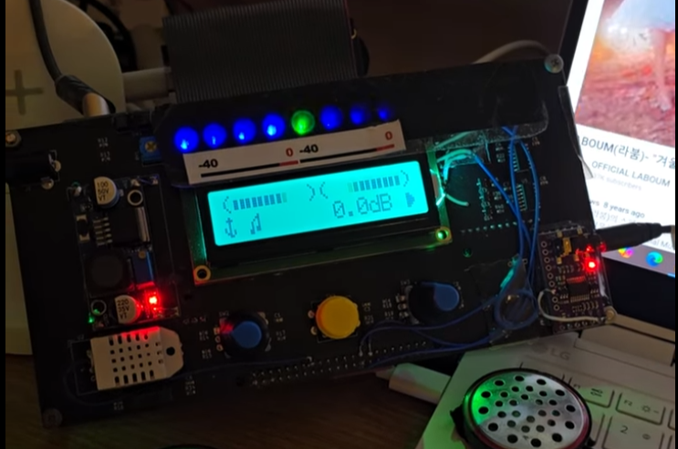

# USB Audio DAC with Spectrum Visualizer Display (STM32F4)

## STM32 기반 USB DAC: 한국어 설명

다른 레포지토리에서 확인할 수 있듯, 리던던시 이슈로 인해 졸업 작품을 두 개를 만들었습니다. 
하나를 소장하고 나머지 하나를 가만히 썩이고 있긴 아까웠기 떄문에, 동일한 하드웨어로 USB DAC를 제작하는 프로젝트입니다.

- USB 오디오 클래스 디바이스로 PC에 연결
- I2S 오디오 입력과 USB 오디오를 합성하여 출력하는 기능 내장, PS3를 하면서 컴퓨터 소리도 들을수 있게 하는 마법의 기능.
- 실시간 VU 미터 기능 지원
- 9밴드 스펙트럼 애널라이저를 LED의 밝기로 매핑, 기존 하드웨어에 장착된 상태 표시기의 디자인을 재해석하여 심미성 향상.
- 1602 캐릭터 LCD + RGB 백라이트 사용
- 온도 및 습도계 기능 (이전의 프로젝트에 있던 것 그대로 사용)

## Introduction

This firmware turns a custom STM32F4 + PCM5102 DAC board from my prize-winning capstone project into a standalone USB audio DAC with real-time visualizers and an environmental display.

The original hardware was too good to leave on a shelf. dual I²S inputs, a PCM5102 audio DAC and USB audio capability. 
Instead of letting it gather some dust, I reused it as a small USB DAC “desk toy” that not only sounds clean, but is also fun to watch on the desk.

### What it does

- Enumerates as a **USB Audio Class** device (stereo, up to 24-bit) on STM32F4  
- Mixes **USB audio + I²S line input + I²S microphone** in a float domain mixer  
- Drives a **PCM5102 DAC** over I²S2 with double-buffered DMA
- Computes **real-time VU meters** (-60…0 dBFS) for USB, I²S2 and mixer paths
- Runs a **fixed-point 9-band spectrum analyzer** (`spectrum9.c`) and maps the result
  to a 9-LED bar with gamma correction and smoothing
- Uses a **16×2 character LCD** as a dashboard:
  - Compact USB L/R VU meters
  - Full-screen 2-row bar-graph VU mode
  - Sample rate readout: `44.1k`, `48.0k`, `96.0k`
  - Volume display in both **step (0..120)** and **dBFS (-60.0..0.0 dB)**,
    using 0.5 dB steps
  - Clip warning that temporarily forces the LCD color to red and holds it
- Reads **temperature and humidity** from a DHT22 sensor and overlays them on the LCD
  (e.g. `23.4° 45%`, or `--.-° --%` if the sensor fails)

### Inputs & controls

- **Rotary encoder A**: controls the USB DAC software volume (`PCAudioVolume`, 0..120)
- **Rotary encoder B**: reserved for future features / debug
- **3 push buttons** with debounced short/long-press detection
  - Button 0 short-press: cycles through display modes:
    1. Mini USB VU + sample rate + volume
    2. Full-screen USB VU (2 rows)
    3. Mini USB VU + temperature / humidity overlay
- **Power key input** with debounced state and edge detection

### Implementation details

- Uses **double-buffered DMA** on I²S2 (full-duplex) and I²S3 for glitch-free playback
- USB audio endpoint is handled by a custom `usbd_audio_if.c` that:
  - Feeds a Q31 ring buffer for the mixer
  - Decimates the stream (×8) into `spectrum9.c` for FFT without loading the mixer
- 9-LED bar is driven via `LEDcontrol.c`:
  - 0..4096 linear input, gamma-corrected PWM output
  - Optional breathing pattern + external “spectrum” mode
  - Exponential smoothing to avoid sudden pops or flicker
- The LCD UI is built on top of a shadow-buffered `LCDUI` layer and a set of
  custom characters (`customchar.c`) for VU bars, thermometer, etc.
- Environmental display is handled by `env_display.c` on top of a DHT22 driver,
  with basic range checks and calibration offsets/scales.
